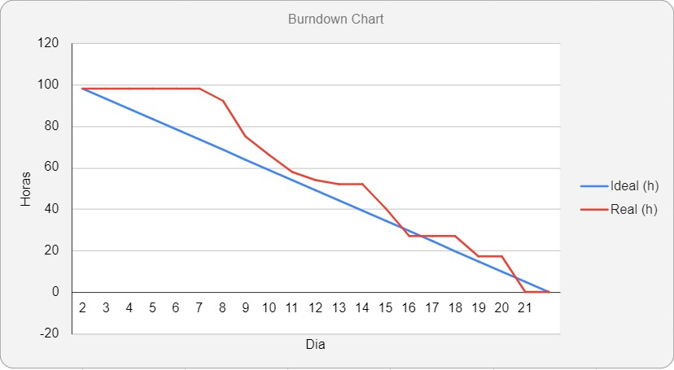

<h1 align="center">Sprint 2: 15/04/2024 a 06/05/2024</h1>

    <a href="#objetivos">Objetivos da sprint</a> &nbsp |&nbsp &nbsp
    <a href="#entregas">Entregas</a> &nbsp |&nbsp &nbsp
    <a href="#metricas">Métricas do time</a>

O projeto tem como objetivo o desenvolvimento de uma aplicação web que recebe dados de um arquivo excel das vendas de uma empresa e gera um dashboard desse arquivo, onde tanto o administrador, quanto o vendedor terão acesso a gráficos relacionados a suas vendas. Tendo em mente o MVP, a 2° Sprint deu início com a separação da tela inicial para o vendedor e para o administrador, que possuem gráficos de pizza, coluna e linha com filtros por mês, ano e preço para melhor visualização das vendas, além das telas de inserção de arquivo, onde é possível inserir o arquivo excel e seus valores afetarão os dados apresentados na tela inicial e a tela de comissão onde é possível alterar o valor de cada comissão.

## 🎯 Objetivos da Sprint

Os objetivos da sprint foram:

- **Filtros para os Gráficos**: Filtros para melhor visualização das vendas
- **Tela de Inserção de Arquivo**: Tela para inserir arquivos excel e passar essas informações para outras telas 
- **Tela de Comissão**: Tela para visualização e alteração dos valores das comissões

## ✔️ Entregas

Para esta entrega, utilizamos a metodologia Scrum, sendo alguns artefatos o Product Backlog contendo as User Stories, o Burndown Chart e as divisões da equipe, como o PO, o Scrum Master e o Dev Team.

→ [Voltar ao topo](#topo)

## 📈 Métricas da equipe

As tarefas da equipe foram divididas entre Backend e Frontend para os integrantes, onde os que possuiam as tarefas de Backend ficavam responsáveis por inserirem as funcionalidades nas interfaces gráficas criadas pelos integrantes que estavam responsáveis por criar a páginas de comissão e inserção de arquivos, além de melhorias nas telas de Administrador e vendedor. 

- O acompanhamento de atividades, de responsabilidade do Scrum Master, se encontra na imagem adiante, que contém o gráfico Burndown gerado pela equipe (onde o eixo X são os dias trabalhados na sprint e os valores do eixo Y representam as horas estimadas de esforço somadas), incluindo as atividades desenvolvidas e seus responsáveis.

    

→ [Voltar ao topo](#topo)
