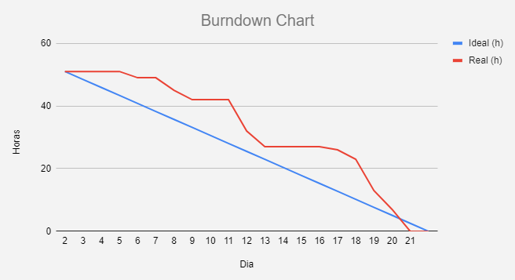

<h1 align="center">Sprint 3: 05/05/2024 a 26/05/2024</h1>

    <a href="#objetivos">Objetivos da sprint</a> &nbsp |&nbsp &nbsp
    <a href="#entregas">Entregas</a> &nbsp |&nbsp &nbsp
    <a href="#metricas">Métricas do time</a>

O projeto tem como objetivo o desenvolvimento de uma aplicação web que recebe dados de um arquivo excel das vendas de uma empresa e gera um dashboard desse arquivo, onde tanto o administrador, quanto o vendedor terão acesso a gráficos relacionados a suas vendas. Tendo em mente o MVP, a 3° Sprint deu início com a produção das telas de usuários, clientes, produtos e vendas, onde cada uma delas apresenta os dados correspondentes no banco de dados, alterações nas páginas de dashboard, fazendo com que o filtro selecionado seja aplicado a todos os gráficos.

## 🎯 Objetivos da Sprint

Os objetivos da sprint foram:

- **Filtros Globais**: Filtros serem aplicados a todos os gráficos
- **Função de alterar comissão**: Inputs alterarem os valores da comissão no banco de dados
- **Tela de Usuários**: Tela para a visualização dos usuários cadastrados no banco de dados
- **Tela de Clientes**: Tela para a visualização dos clientes cadastrados no banco de dados
- **Tela de Produtos**: Tela para a visualização dos produtos cadastrados no banco de dados
- **Tela de Vendas**: Tela para a visualização dos vendas cadastrados no banco de dados

## ✔️ Entregas

Para esta entrega, utilizamos a metodologia Scrum, sendo alguns artefatos o Product Backlog contendo as User Stories, o Burndown Chart e as divisões da equipe, como o PO, o Scrum Master e o Dev Team.

→ [Voltar ao topo](#topo)

## 📈 Métricas da equipe

As tarefas da equipe foram divididas entre Backend, Frontend e Banco de Dados para os integrantes, onde os que possuiam as tarefas de Backend ficavam responsáveis por inserirem as funcionalidades nas interfaces gráficas criadas pelos integrantes que estavam responsáveis por criar a página de usuários, clientes, produtos e vendas, enquanto que a responsabilidade de quem possui a tarefa de banco de dados é criar o banco e rotas para garantir o fornecimentos dos dados desejados do banco.

- O acompanhamento de atividades, de responsabilidade do Scrum Master, se encontra na imagem adiante, que contém o gráfico Burndown gerado pela equipe (onde o eixo X são os dias trabalhados na sprint e os valores do eixo Y representam as horas estimadas de esforço somadas), incluindo as atividades desenvolvidas e seus responsáveis.

→ [Voltar ao topo](#topo)
